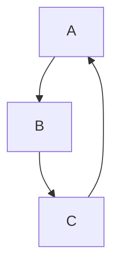
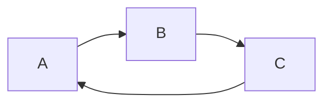
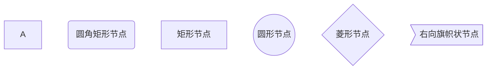
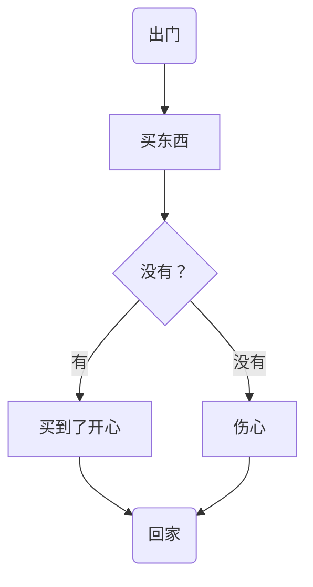
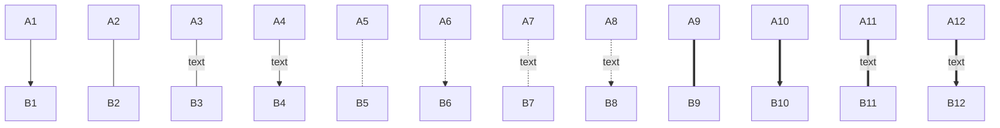
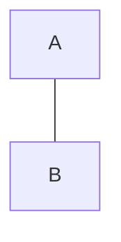
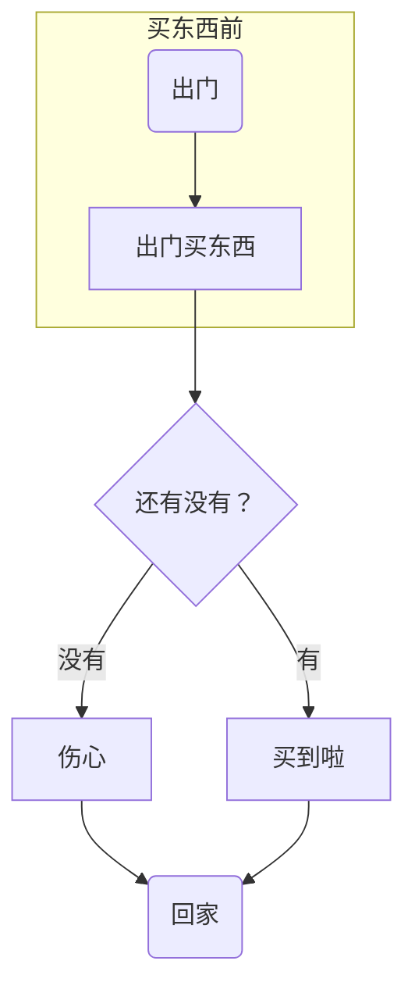
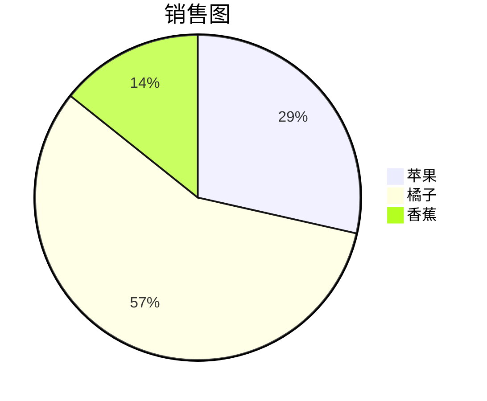
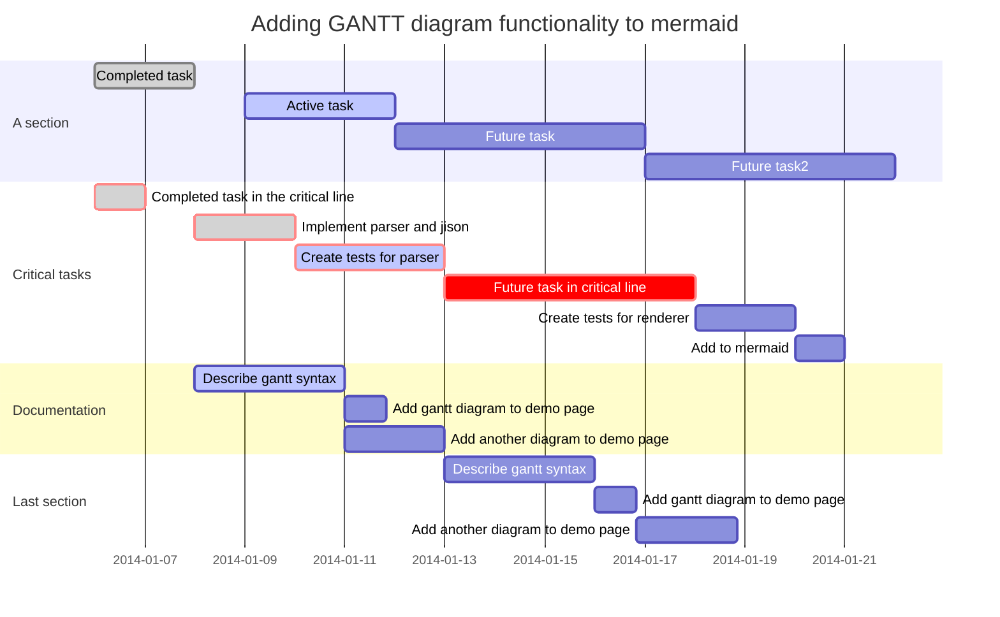

## 1. 标题

```markdown
# 标题名字（井号的个数代表标题的级数）
```

一级标题使用 1 个#

二级标题使用 2 个#

三级标题使用 3 个#

四级标题使 4 用个#

五级标题使用 5 个#

六级标题使用 6 个#

最多支持六级标题#

## 2. 文字相关

### 2.1 删除线

```markdown
这就是 ~~删除线~~ (使用波浪号)
```

这就是 ~~删除线~~ (使用波浪号)

### 2.2 斜体

```markdown
这是用来 *斜体* 的 _文本_
```

这是用来 *斜体* 的 _文本_

### 2.3 加粗

```markdown
这是用来 **加粗** 的 __文本__
```

这是用来 **加粗** 的 __文本__

### 2.4 斜体+加粗

```markdown
这是用来 ***斜体+加粗*** 的 ___文本___
```

这是用来 ***斜体+加粗*** 的 ___文本___

### 2.5 下划线

下划线是 HTML 语法

```html
<u>下划线</u>
```

<u>下划线</u>

快捷键： `ctrl` + `u`

### 2.6 高亮

```markdown
这是用来 ==高亮== 的文本
```

这是用来 ==高亮== 的文本

## 3. 符号及数学公式

### 3.1 下标

```markdown
水 $H_2O$
双氧水 $H_2O_2$
```

水 $H_2O$
双氧水 $H_2O_2$

### 3.2 上标

```markdown
面积 $m^2$
体积 $m^3$
3的xy次方 $3^{xy}$
```

面积 $m^2$
体积 $m^3$
3 的 xy 次方 $3^{xy}$

### 3.3 运算符

```Markdown
乘号: $\times$
$10 = 2 \times 5$
除号: $\div$
加减号: $\pm$
开方：$\sqrt{ x }$
开n次方：$\sqrt[ n ]{ x }$
```

乘号: $\times$
$10 = 2 \times 5$
除号: $\div$
加减号: $\pm$
开方：$\sqrt{ x }$
开 n 次方：$\sqrt[ n ]{ x }$

把符号往正上方或者正下方放

比如 :
```Markdown
$\max \limits_{x_0}$
$\min \limits^{x_0}$
$\min \limits^{x_0}_{x_0}$
```
$\max \limits_{x_0}$
$\min \limits^{x_0}$
$\min\limits^{x_0}_{x_0}$

> limits 只允许用于运算符上, 其他的不行

### 3.4 向量

```Markdown
$\vec{ a }$
$\vec a \cdot \vec b = 0$
```
$\vec{ a }$
$\vec a \cdot \vec b = 0$

### 3.5 微积分

```Markdown
$\int_0^2 x^2 {\rm d}x$
$\lim\limits_{n \rightarrow +\infty} \frac{1}{n(n+1)}$
```

$\int_0^2 x^2 {\rm d}x$
$\lim\limits_{n \rightarrow +\infty} \frac{1}{n(n+1)}$

### 3.6 求和求极限

```Markdown
$\sum_{i = 1}^n{x_i}$
$\sum\limits_{i = 1}^n{x_i}$
$\sum_{i=0}^n \frac{1}{i^2}$
$\sum\limits_{i=0}^n \frac{1}{i^2}$
$\frac{\sum_{i = 1}^n{x_i}}{n}$
$\prod_{i=0}^n \frac{1}{i^2}$
```

$\sum_{i = 1}^n{x_i}$
$\sum\limits_{i = 1}^n{x_i}$
$\sum_{i=0}^n \frac{1}{i^2}$
$\sum\limits_{i=0}^n \frac{1}{i^2}$
$\frac{\sum_{i = 1}^n{x_i}}{n}$
$\prod_{i=0}^n \frac{1}{i^2}$

### 3.7 括号
```Markdown
$\{ \}$
${a\choose b}$
$\frac{x}{y}$
$\left ()\right.$
```

$\{ \}$
${a\choose b}$
$\frac{x}{y}$
$\left ()\right.$

### 3.8 省略号
```Markdown
跟文本底线对齐的省略号 $\ldots$
横向的省略号 $\cdots$
竖向的省略号 $\vdots$
对角线方向的省略号 $\ddots$
```
跟文本底线对齐的省略号 $\ldots$
横向的省略号 $\cdots$
竖向的省略号 $\vdots$
对角线方向的省略号 $\ddots$
### 3.9 数学符号
```Markdown
因为：$\because$
所以：$\therefore$
任意：$\forall$
存在：$\exists$
∣ ：$\mid$  
\  ：$\backslash$ 
∗ ：$\ast$ 
≤ ：$\leq$  
≥ ：$\geq$
≠ ：$\neq$ 
≈ ：$\approx$  
≡ ：$\equiv$ 
∑ ：$\sum$
∏ ：$\prod$  
∐ ：$\coprod$  
⨀ ：$\bigodot$  
⨂ ：$\bigotimes$  
⨁ ：$\bigoplus$
```
因为：$\because$
所以：$\therefore$
任意：$\forall$
存在：$\exists$
∣ ：$\mid$
\  ：$\backslash$
∗ ：$\ast$
≤ ：$\leq$
≥ ：$\geq$
≠ ：$\neq$
≈ ：$\approx$
≡ ：$\equiv$
∑ ：$\sum$
∏ ：$\prod$
∐ ：$\coprod$
⨀ ：$\bigodot$
⨂ ：$\bigotimes$
⨁ ：$\bigoplus$
### 3.10 百分号、约等号
```Markdown
$\%$
$\approx$
```
$\%$
$\approx$

### 3.11 向上/下取整

```Markdown
向上:

$\lceil$  
$\rceil$

向下:

$\lfloor$
$\rfloor$

$\lceil$$\frac{4}{5}$$\rceil$
$\lfloor$$\frac{4}{5}$$\rfloor$
```
向上:

$\lceil$
$\rceil$

向下:

$\lfloor$
$\rfloor$

$\lceil$ $\frac{4}{5}$ $\rceil$
$\lfloor$ $\frac{4}{5}$ $\rfloor$
### 3.12 希腊字母

| 希腊字母 | 写法 | 希腊字母|写法|
| ---- | ---- | ----|----|
| $\alpha$  |  `$\alpha$`   |   $\beta$   |    `$\beta$`    |
|  $\gamma$ | `$\gamma$`     |   $\Gamma$     |  `$\Gamma$`      |
|  $\delta$ |  `$\delta$`   |    $\Delta$    |    `$\Delta$`    |
|  $\epsilon$ |  `$\epsilon$`   |   $\varepsilon$     |   `$\varepsilon$`     |
|  $\zeta$  |  `$\zeta$`  |  $\eta$  |  `$\eta$`  |
| $\theta$ | `$\theta$` | $\Theta$ | `$\Theta$` |
| $\vartheta$ |  `$\vartheta$`  |  $\iota$   | `$\iota$`  |
|  $\kappa$   | `$\kappa$`   |  $\lambda$ | `$\lambda$` |
|  $\Lambda$  |  `$\Lambda$` | $\mu$  | `$\mu$`  |
|  $\nu$ | `$\nu$`  | $\xi$ |  `$\xi$` |
| $\Xi$  |  `$\Xi$` | $\pi$  | `$\pi$` |
|   $\Pi$    |   `$\Pi$`    |   $\varpi$   |   `$\varpi$`   |
|   $\rho$    |   `$\rho$`    |   $\varrho$   |   `$\varrho$`   |
|  $\sigma$     |  `$\sigma$`     |   $\Sigma$  |   `$\Sigma$`  |
|    $\varsigma$   |   `$\varsigma$`    |  $\tau$    |  `$\tau$`    |
|    $\upsilon$   |   `$\upsilon$`    |         $\Upsilon$   | `$\Upsilon$` |
|   $\phi$    |   `$\phi$`    |  $\Phi$    |   `$\Phi$`   |
|   $\varphi$    |   `$\varphi$`    |      $\chi$   | `$\chi$` |
|  $\psi$  |    `$\psi$`   |   $\Psi$   |   `$\Psi$`   |
|   $\Omega$    |   `$\Omega$`    | $\omega$     |   `$\omega$`   |
### 3.13 集合运算符
```Markdown
∅: $\emptyset$ 
∈: $\in$ 
∉: $\notin$  
⊂: $\subset$  
⊃: $\supset$  
⊆: $\subseteq$  
⊇: $\supseteq$  
⋂: $\bigcap$  
⋃: $\bigcup$  
⋁: $\bigvee$  
⋀: $\bigwedge$  
⨄: $\biguplus$  
⨆: $\bigsqcup$
$A\\2$
```
∅: $\emptyset$
∈: $\in$
∉: $\notin$
⊂: $\subset$
⊃: $\supset$
⊆: $\subseteq$
⊇: $\supseteq$
⋂: $\bigcap$
⋃: $\bigcup$
⋁: $\bigvee$
⋀: $\bigwedge$
⨄: $\biguplus$
⨆: $\bigsqcup$
$A\\2$

### 3.14 对数符号
```Markdown
log:$\log$ 
lg:$\lg$ 
ln:$\ln$
```
log: $\log$
lg: $\lg$
ln: $\ln$
### 3.15 箭头符号
```Markdown
↑:$\uparrow$  
↓:$\downarrow$  
⇑:$\Uparrow$
⇓:$\Downarrow$
→:$\rightarrow$ 
←:$\leftarrow$ 
⇒:$\Rightarrow$  
⇐:$\Leftarrow$
⟶:$\longrightarrow$ 
⟵:$\longleftarrow$
⟹:$\Longrightarrow$
⟸:$\Longleftarrow$
$\stackrel{+}{\Rightarrow}$
$\stackrel{*}{\Rightarrow}$
```
↑: $\uparrow$
↓: $\downarrow$
⇑: $\Uparrow$
⇓: $\Downarrow$
→: $\rightarrow$
←: $\leftarrow$
⇒: $\Rightarrow$
⇐: $\Leftarrow$
⟶: $\longrightarrow$
⟵: $\longleftarrow$
⟹: $\Longrightarrow$
⟸: $\Longleftarrow$
$\stackrel{+}{\Rightarrow}$
$\stackrel{*}{\Rightarrow}$

### 3.16 三角运算符
```Markdown
⊥:$\bot$  
∠:$\angle$  
度数:$30^\circ$  
sin:$\sin$  
cos:$\cos$  
tan:$\tan$  
cot:$\cot$  
sec:$\sec$ 
csc:$\csc$
```
⊥: $\bot$
∠: $\angle$
度数: $30^\circ$
sin: $\sin$
cos: $\cos$
tan: $\tan$
cot: $\cot$
sec: $\sec$
csc: $\csc$

### 3.17 分段函数的写法
用法：`\begin{cases}xxxxxxx \\ xxxxxxx \end{cases}`
```Markdown
$L(Y,f(x))=\begin{cases}1, Y!=f(x) \\0, Y = f(x)\end{cases}$
```
$L(Y,f(x))=\begin{cases}1, Y!=f(x) \\0, Y = f(x)\end{cases}$
```Markdown
$L(Y,f(x))=\begin{cases}1, Y!=f(x) \\0, Y = f(x)\\ -1,Y=\infty \end{cases}$
```
$L(Y,f(x))=\begin{cases}1, Y!=f(x) \\0, Y = f(x)\\ -1,Y=\infty \end{cases}$
```Markdown
$M_p=\begin{cases}x_{([np]+1)} {\quad}{\quad} np不是整数 \\ \frac{1}{2}(x_{(np)}+x_{(np+1)}) {\quad}{\quad} np为整数\end{cases}$
```
$M_p=\begin{cases}x_{([np]+1)} {\quad}{\quad} np不是整数 \\ \frac{1}{2}(x_{(np)}+x_{(np+1)}) {\quad}{\quad} np为整数\end{cases}$
### 3.18 在数学公式中加空格
`${\quad}$` : 输出一个空格

`${\,}$` : 输出半个空格

在数学模式下如果输不出空格就先加大括号 `{}`; 在复杂的公式下可能识别不出, 就需要加 `{}`

|空格宽度|写法|示例 : x y|
| ----| ---- | ----|
|两个空格| `$x \qquad y$` | $x \qquad y$ |
|一个空格| `$x \quad y$` | $x \quad y$ |
|大空格| `$x \ y$` | $x \ y$ |
|中等空格| `$x \; y$` | $x \; y$ |
|小空格| `$x\,y$` | $x\,y$ |
|紧贴| `$x\!y$` | $x\!y$ |
### 3.19 绝对值
```Markdown
$|\overline{x}|$
$|x|$
```
$|\overline{x}|$
$|x|$

### 3.20 输出矩阵
```Markdown
$\begin{matrix} 1 & 2 & 3 \\ 4 & 5 & 6 \\ 7 & 8 & 9 \end{matrix}$
\\:换行
```
$\begin{matrix} 1 & 2 & 3 \\ 4 & 5 & 6 \\ 7 & 8 & 9 \end{matrix}$

#### 3.20.1 带大圆括号的矩阵
```Markdown
$\left( \begin{matrix} 1 & 2 & 3 \\ 4 & 5 & 6 \\ 7 & 8 & 9 \end{matrix} \right)$
```
$\left( \begin{matrix} 1 & 2 & 3 \\ 4 & 5 & 6 \\ 7 & 8 & 9 \end{matrix} \right)$

格式 : `\left(` : 代表左圆括号 `\right)` : 代表右圆括号

#### 3.20.2 带中/方括号的矩阵
```Markdown
$\left[ \begin{matrix} 1 & 2 & 3 \\ 4 & 5 & 6 \\ 7 & 8 & 9 \end{matrix} \right]$
```
$\left[ \begin{matrix} 1 & 2 & 3 \\ 4 & 5 & 6 \\ 7 & 8 & 9 \end{matrix} \right]$

格式 : `\left[` : 代表左中括号 `\right]` : 代表右中括号

#### 3.20.3 带大括号的矩阵
```Markdown
$\left\{ \begin{matrix} 1 & 2 & 3 \\ 4 & 5 & 6 \\ 7 & 8 & 9 \end{matrix} \right\}$
```
$\left\{ \begin{matrix} 1 & 2 & 3 \\ 4 & 5 & 6 \\ 7 & 8 & 9 \end{matrix} \right\}$

格式 : `\left\{` : 代表左大括号 `\right\}` : 代表右大括号

### 3.21 阵列
```Markdown
$\begin{array}{c|ccc} {↓}&{a}&{b}&{c}\\ \hline {R_1}&{c}&{b}&{a}\\ {R_2}&{b}&{c}&{c}\\ \end{array}$
```
$\begin{array}{c|ccc} {↓}&{a}&{b}&{c}\\ \hline {R_1}&{c}&{b}&{a}\\ {R_2}&{b}&{c}&{c}\\ \end{array}$

+ 需要 array 环境：起始、结束处以 `{array}` 声明
+ 对齐方式：在{array}后以{逐一声明}
    -   左对齐：`l` ；剧中：`c`；右对齐：`r`
    -   竖直线：在声明对齐方式时，插入 `|` 建立竖直线
```Markdown
$\begin{array}{r|c|c|l|} {p}&{x}&{y}&{z}\\ \hline {R_1}&{1}&{2}&{3}\\ {R_2}&{3}&{2}&{1}\\ \end{array}$
```
$\begin{array}{r|c|c|l|} {p}&{x}&{y}&{z}\\ \hline {R_1}&{1}&{2}&{3}\\ {R_2}&{3}&{2}&{1}\\ \end{array}$

### 3.22 公式推导
```Markdown
$\begin {aligned} 推导内容1 &\Rightarrow 推导内容2 \\ &\Rightarrow 推导内容3 \\ &\Rightarrow 推导内容4 \end {aligned}$
```
$\begin {aligned} 推导内容1 &\Rightarrow 推导内容2 \\ &\Rightarrow 推导内容3 \\ &\Rightarrow 推导内容4 \end {aligned}$

`&` 符号对齐列, `\\`符号换行, ` \` 转义作用

```Markdown
$\begin {aligned} 式子1 &= 式子2 \\ &= 式子3 \\ &= 式子4 \end {aligned}$
```
$\begin {aligned} 式子1 &= 式子2 \\ &= 式子3 \\ &= 式子4 \end {aligned}$

### 3.23 回归方程符号

|样式|写法|样式|写法|
| ---- | ---- | ----| -----|
| $\bar{x}$ | `$\bar{x}$` | $\grave{\eta}$ | `$\grave{\eta}$` |
| $\dot{x}$ | `$\dot{x}$` | $\breve{a}$ | `$\breve{a}$` |
| $\hat{\alpha}$ | `$\hat{\alpha}$` | $\check{\alpha}$ | `$\check{\alpha}$` |
| $\ddot{y}$ | `$\ddot{y}$` | $\tilde{\iota}$ | `$\tilde{\iota}$` |
| $\acute{\eta}$ | `$\acute{\eta}$` ||
## 4. 表格

使用 `|` 来分隔不同的单元格，使用 `-` 来分隔表头和其他行：

```markdown
| 名称 | 价格 |
| ---- | ---- |
| 炸鸡 | 19   |
| 可乐 | 5    |
```

> 为了使 Markdown 更清晰，`|` 和 `-` 两侧需要至少有一个空格（最左侧和最右侧的 `|` 外就不需要了）

| 名称 | 价格 |
| ---- | ---- |
| 炸鸡 | 19   |
| 可乐 | 5    |

为了美观，可以使用空格对齐不同行的单元格，并在左右两侧都使用 `|` 来标记单元格边界，在表头下方的分隔线标记中加入 `:`，即可标记下方单元格内容的对齐方式：

```markdown
|    名称       | 价格  |
| :------------ | :---: |
| 炸鸡          | 19    |
| 可乐          |  32   |
```

| 名称         | 价格 |
| :------------ | :---: |
| 炸鸡 |  19   |
| 可乐          |  32   |

 若想对一段长文本进行换行，可以在 **中间** 插入一个 `<br>`（换行标签)
## 5. 引用

```markdown
>“大风起兮云飞扬”
```

> “大风起兮云飞扬”

```markdown
>也可以在引用中
>>使用嵌套的引用
```

>也可以在引用中
>
>>使用嵌套的引用

## 6. 列表

### 6.1 无序列表

```markdown
* 可以使用 `*` 作为标记
+ 也可以使用 `+`
- 或者 `-`
	+ 使用tab键可以使用多级列表
```

* 可以使用 `*` 作为标记

+ 也可以使用 `+`

- 或者 `-`

	+ 使用 tab 键可以使用多级列表

### 6.2 有序列表

```markdown
1. 有序列表以数字和 `.` 开始
3. 数字的序列并不会影响生成的列表序列
4. 但仍然推荐按照自然顺序（1.2.3...）编写
```

1. 有序列表以数字和 `.` 开始
2. 数字的序列并不会影响生成的列表序列
3. 但仍然推荐按照自然顺序（1.2.3...）编写

可以使用：`数字\.` 来取消显示为列表（用反斜杠进行转义）

## 7. 代码
### 7.1 代码块
```markdown
```语言
代码
```
```语言
代码
```

### 7.2 行内代码

```markdown
可以通过``，插入行内代码（`是Tab键上边、数字1键左侧的那个按键）

`Markdown`
```
`Markdown`

### 7.3 转换规则

代码块中的文本（包括 Markdown 语法）都会显示为原始内容

## 8. 分隔线

可以在一行中使用三个或更多的 `*`、`-` 或 `_` 来添加分隔线：

```markdown
***
------
___
```

***

------

_____

## 9. 待办事项
```Markdown
- [ ] 
```
- [ ]
- [x]
## 10. 空格
在一些编辑器或者支持markdown的笔记软件里，无论你打多少个空格，它只会显示单个空格的距离

可以使用 HTML 中空格的字符实体——`&nbsp;` 

若要添加多个空格，就输入多个——`&nbsp;&nbsp;&nbsp;&nbsp;&nbsp;&nbsp;&nbsp;`

例如：

```html
这里有&nbsp;&nbsp;&nbsp;&nbsp;&nbsp;&nbsp;6个空格分隔
```
结果：
这里有&nbsp;&nbsp;&nbsp;&nbsp;&nbsp;&nbsp; 6 个空格分隔

## 11. 链接

### 11.1 超链接

格式为 `[link text](link)`

```markdown
[帮助文档](https://support.typora.io/Links/#faq)
```

[帮助文档](https://support.typora.io/Links/#faq)

### 11.2 自动链接

使用`<>`包括的 URL 或邮箱地址会被自动转换为超链接

```markdown
<https://www.baidu.com>

<123@email.com>
```

<https://www.baidu.com>

[123@email.com](mailto:123@email.com)

## 12. 图片

```markdown

```

### 12.1 网上的图片

```markdown

```


### 12.2 本地图片

```markdown

在同一个文件夹里（用相对路径）
或者直接拷贝
```

## 13. 画图

markdown 画图也是轻量级的，功能并不全

Mermaid 是一个用于画流程图、状态图、时序图、甘特图的库，使用 JS 进行本地渲染，广泛集成于许多 Markdown 编辑器中

Mermaid 作为一个使用 JS 渲染的库，生成的不是一个“图片”，而是一段 HTML 代码（不同的编辑器渲染的可能不一样）

### 13.1 流程图 (graph)

#### 13.1.1 概述

```markdown
graph 方向描述
    图表中的其他语句...
```

关键字 graph 表示一个流程图的开始，同时需要指定该图的方向

其中“方向描述”为：

| 用词 | 含义     |
| :--- | :------- |
| TB   | 从上到下 |
| BT   | 从下到上 |
| RL   | 从右到左 |
| LR   | 从左到右 |

> T = TOP，B = BOTTOM，L = LEFT，R = RIGHT，D = DOWN

最常用的布局方向是 TB、LR

```markdown
graph TB;
  A-->B
  B-->C
  C-->A
 
```




```markdown
graph LR;
  A-->B
  B-->C
  C-->A
```




#### 13.1.2 节点形状

| 表述       | 说明           | 含义                                                 |
| :--------- | :------------- | ---------------------------------------------------- |
| id[文字]   | 矩形节点       | 表示过程，也就是整个流程中的一个环节                 |
| id (文字)   | 圆角矩形节点   | 表示开始和结束                                       |
| id ((文字)) | 圆形节点       | 表示连接。为避免流程过长或有交叉，可将流程切开。成对 |
| id{文字}   | 菱形节点       | 表示判断、决策                                       |
| id>文字]   | 右向旗帜状节点 |                                                      |

单向箭头线段：表示流程进行方向

>id 即为节点的唯一标识，A~F 是当前节点名字，类似于变量名，画图时便于引用
>
>括号内是节点中要显示的文字，默认节点的名字和显示的文字都为 A


```markdown
graph TB
  A
  B(圆角矩形节点)
  C[矩形节点]
  D((圆形节点))
  E{菱形节点}
  F>右向旗帜状节点] 
```



``` markdown
graph TB
    begin(出门)--> buy[买东西]
    buy --> IsRemaining{"没有？"}
    IsRemaining -->|有|happy[买到了开心]--> goBack(回家)
    IsRemaining --没有--> sad["伤心"]--> goBack
    
```




#### 13.1.3 连线

```markdown
graph TB
  A1-->B1
  A2---B2
  A3--text---B3
  A4--text-->B4
  A5-.-B5
  A6-.->B6
  A7-.text.-B7
  A8-.text.->B8
  A9===B9
  A10==>B10
  A11==text===B11
  A12==text==>B12
```






#### 13.1.4 子图表

使用以下语法添加子图表

```markdown
subgraph 子图表名称
    子图表中的描述语句...
end
```

```markdown
graph TB
	  subgraph 买东西前
   			 begin(出门)--> buy[出门买东西]
    end
    buy --> IsRemaining{"还有没有？"}
    IsRemaining --没有--> sad["伤心"]--> goBack(回家)
    IsRemaining -->|有|happy[买到啦]--> goBack
```



### 13.2 饼图（Pie）

```markdown
pie
title 销售图
"苹果" : 100
"橘子" : 200.4
"香蕉" : 50
```


### 13.3 甘特图（gantt）

```markdown
  title 标题
	dateFormat 日期格式
	section 部分名
	任务名:参数一, 参数二, 参数三, 参数四，参数五
 
  //参数一：crit（是否重要，红框框） 或者 不填
  //参数二：done（已完成）、active（正在进行） 或者 不填(表示为待完成状态)
  //参数三：取小名 或者 不填
  //参数四：任务开始时间
  //参数五：任务结束时间
```

> [官方教程](https://mermaid-js.github.io/mermaid/#/gantt)

```
gantt
       dateFormat  YYYY-MM-DD
       title Adding GANTT diagram functionality to mermaid

       section A section
       Completed task            :done,    des1, 2014-01-06,2014-01-08
       Active task               :active,  des2, 2014-01-09, 3d
       Future task               :         des3, after des2, 5d
       Future task2              :         des4, after des3, 5d

       section Critical tasks
       Completed task in the critical line :crit, done, 2014-01-06,24h
       Implement parser and jison          :crit, done, after des1, 2d
       Create tests for parser             :crit, active, 3d
       Future task in critical line        :crit, 5d
       Create tests for renderer           :2d
       Add to mermaid                      :1d

       section Documentation
       Describe gantt syntax               :active, a1, after des1, 3d
       Add gantt diagram to demo page      :after a1  , 20h
       Add another diagram to demo page    :doc1, after a1  , 48h

       section Last section
       Describe gantt syntax               :after doc1, 3d
       Add gantt diagram to demo page      :20h
       Add another diagram to demo page    :48h
```



